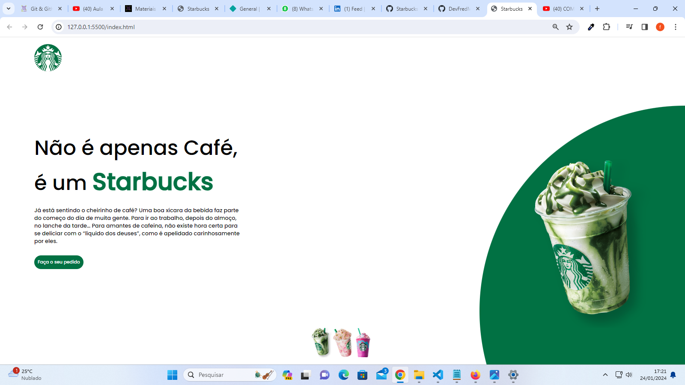
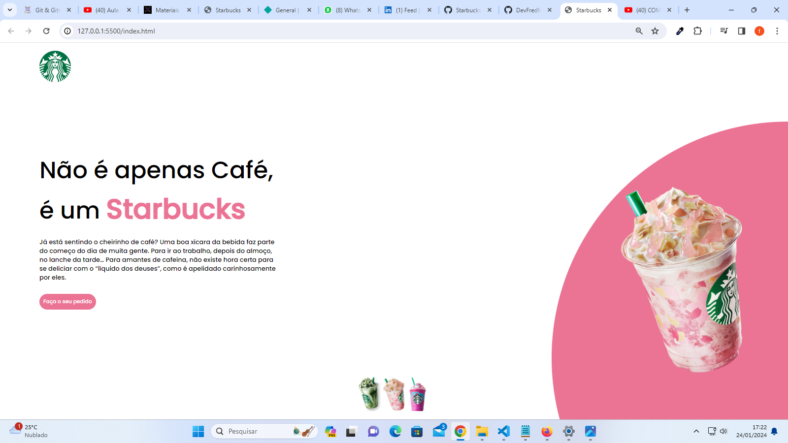
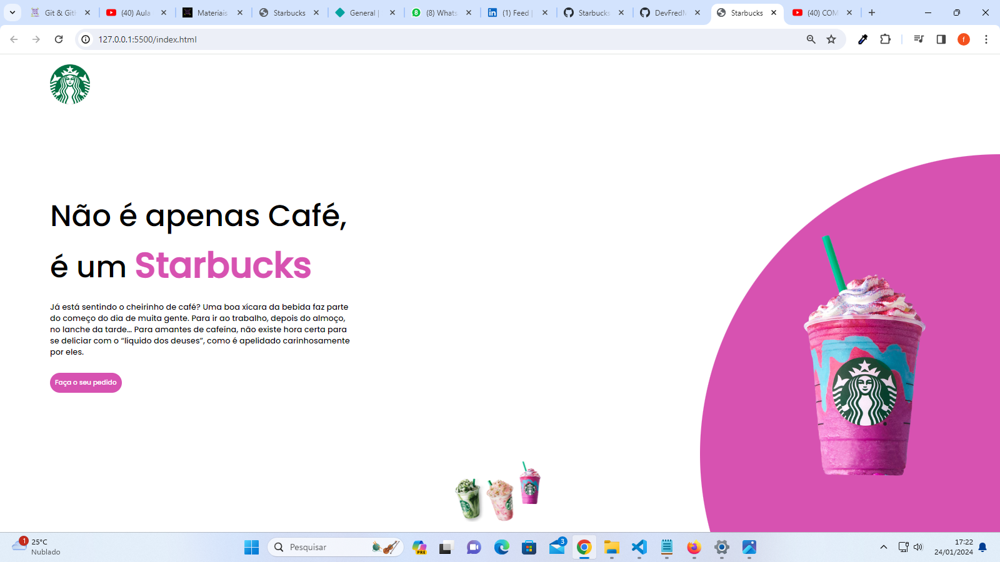

# Starbucks Page

## Sobre
 Projeto da página do Starbucks, que foi desenvolvido durante a missão "Programador do Zero" .

## Tecnologias utilizadas
• HTML; 
• CSS; 
• JavaScript.

## Extra

 
Deploy: <a href="https://fred-starbucks.netlify.app/">https://lnkd.in/dAPrudkw </a>

## Imagens do projeto

